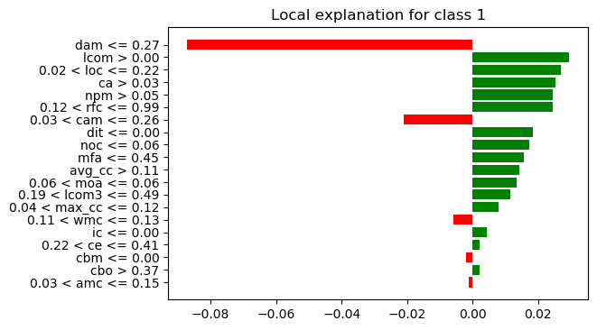

# TimeLIME: Actionable Defect Reduction Tool

## RQ results of TimeLIME

+ To get the results that answer to research questions in the paper, first
run runexp.py to get measurement scores for all planners

+ Then run the specific rqx.py to get results for the corresponding RQ. 

+ A sample result for all 3 RQs is placed under results directory. 

## What is TimeLIME?

A defect predictor can classify clean and buggy codes within a software project by 
learning from class-level CK code metrics. 
TimeLIME aims to interpret such predictor to gain information on what is
the most critical factor contributing to a defect classification.
Then TimeLIME will propose `maintainable` and `achievable` plans to each
individual class within the project. Such plans can be mapped onto some
simple **code refactoring methods**, as summarized in [refactoring.guru](http://refactoring.guru).
The following is an example illustrating how TimeLIME's plans can be applied
by practitioners. 

## Step 1: Explain using LIME 

</img>

## Step 2: Frequent itemset mining

## Step 3: Generate plans

## Step 4: Map plans to refactoring methods

## Step 5: Apply the corresponding method

