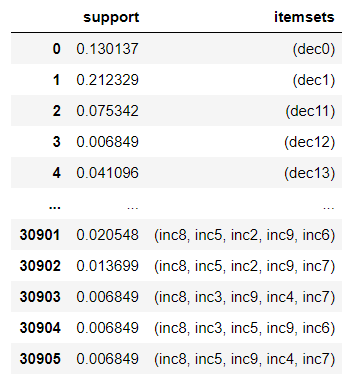
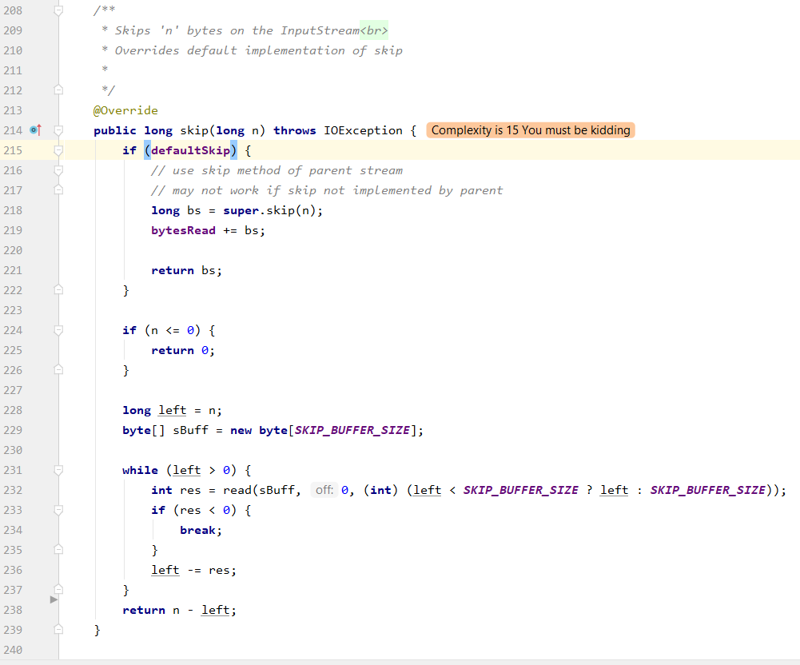
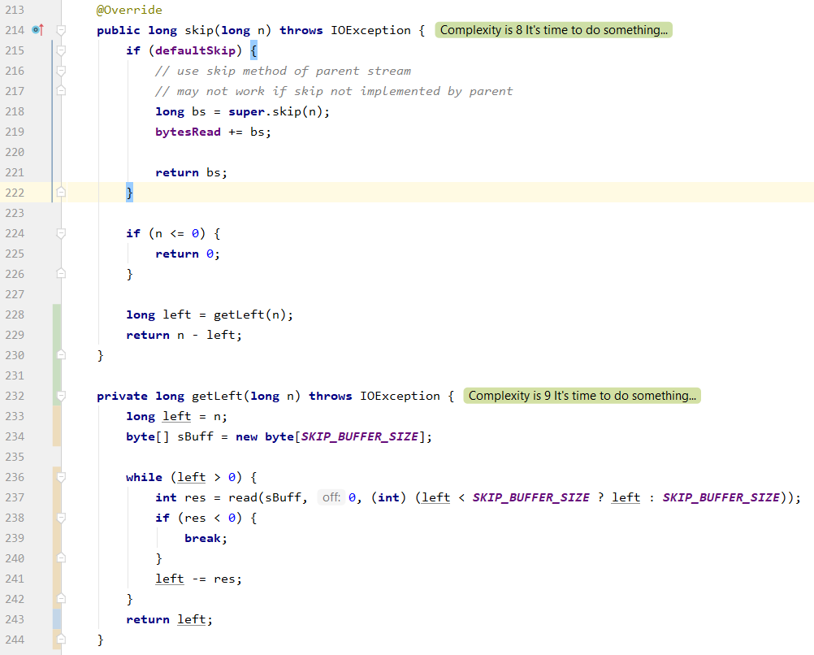

# TimeLIME: Actionable Defect Reduction Tool

## RQ results of TimeLIME

+ To get the results that answer to research questions in the paper, first
run runexp.py to get measurement scores for all planners

+ Then run the specific rqx.py to get results for the corresponding RQ. 

+ A sample result for all 3 RQs is placed under results directory. 

## What is TimeLIME?

A defect predictor can classify clean and buggy codes within a software project by 
learning from class-level CK code metrics. 
TimeLIME aims to interpret such predictor to gain information on what is
the most critical factor contributing to a defect classification.
Then TimeLIME will propose `maintainable` and `achievable` plans to each
individual class within the project. Such plans can be mapped onto some
simple **code refactoring methods**, as summarized in [refactoring.guru](http://refactoring.guru).
The following is an example illustrating how TimeLIME's plans can be applied
by practitioners. 

#Example

## Step 1: Explain using LIME 
LIME will report instance-based feature importance weights. Positive weights 
indicate a positive linear correlation between the feature value and predicted 
defect-proneness, and vice versa.
 
</img>

## Step 2: Frequent itemset mining
Frequent itemset mining will find each unique combination of changes that
occured in the project from `previous` release to `current` release. Such
result will be used to filter out plans if they are not
precedented according to the historical records. TimeLIME only mines
changes that happended to `actionable` features.

</img>

## Step 3: Generate plans
TimeLIME generate plans by finding the maximum conjunction of actionable
changes with precedence support. For the instance used in this example,
the plan could be: `{decrease max_cc; decrease avg_cc; increase dam}`.

## Step 4: Map plans to refactoring methods
One code refactoring method that can match the plan proposed by TimeLIME
is *extract method*. This method can be used to split one method with
relatively high cyclomatic complexity into 2 simpler methods.

## Step 5: Apply the corresponding method

The effect
of *extract method* is shown as follows. By extracting the rather complex piece of code into an individual method,
maintainability and readability will get improved for future maintenance.

* Before :\
  </img>
* After :\
  </img>
  
Apparently, after the *extract method* both `avg_cc` and `max_cc` are
reduced and `dam` increased since the new method is private.

