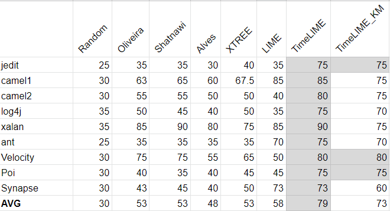
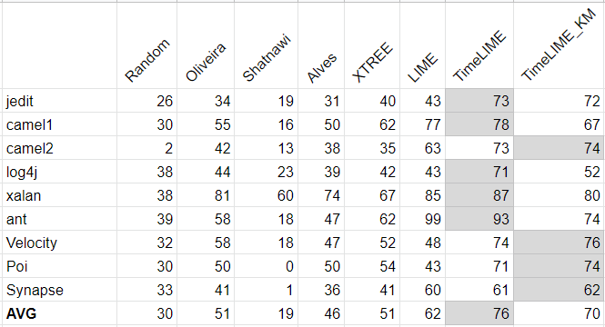
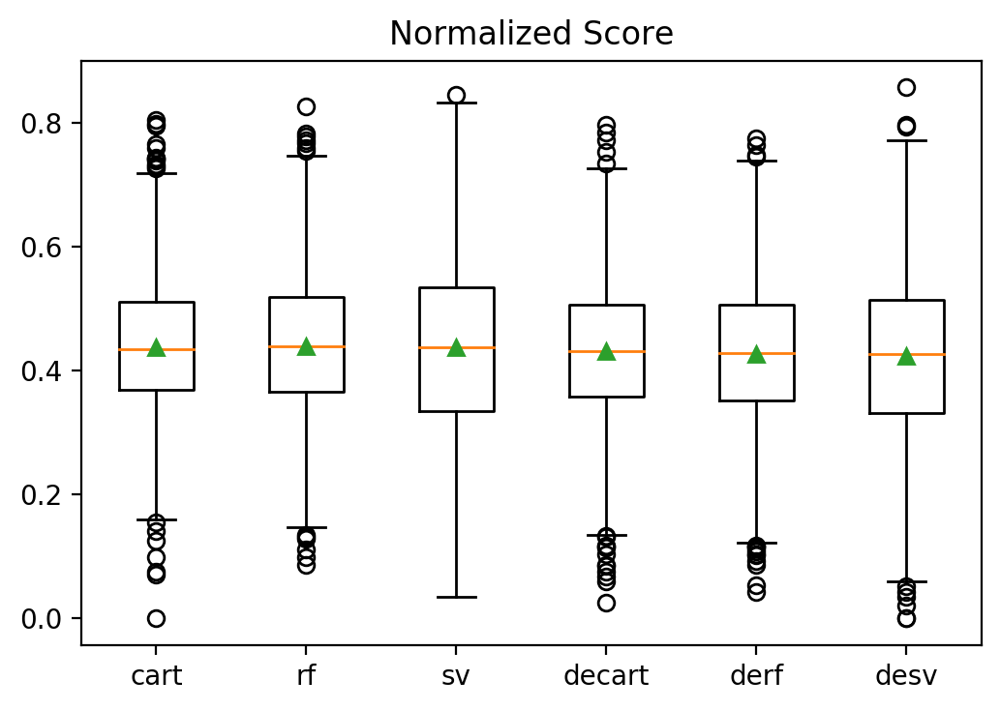

# Summer Report

## Done

* TSE submission: [code](https://github.com/ai-se/TimeLIME) | [paper](https://arxiv.org/pdf/2006.07416.pdf)
    * TimeLIME for defect reduction
* LAS package delivered (with Joy and Rishabh): 
[code](https://github.com/kpeng2019/LAS) |
[package](https://pypi.org/project/LASExplanation/) 
    * Generating explanations for fairness-concerned data    
## In progress
### TimeLIME with clustering:
 
* TimeLIME lacks of generality (make plans per instance).

* Now: 
    1) cluster instances
    2) generate a prototype plan based on each centroid
    3) apply the prototype plan to everyone in the neighborhood.

* Early result:
   * Overlap score:\
   </img>
   * Weighted improvement score:\
   </img> 
  * Lower similarity and weighted scores (but still accpetable)
  * much less effort needed (5 prototypes vs. hundreds of plans)
* Future work:
    * Might try different clustering methods.
    
### TimeLIME for better project health

* Inspired from [Patrick's work](https://arxiv.org/pdf/2006.07240.pdf)
* Same planning process as in the defect reduction task.
* Make plans to optimize project health goals (i.e. stargazers, PR, commits)

* Early result (goal = stars):
   * Overlap score:\
   </img>
   * Weighted improvement score:\
   </img> 
   

* Future work:
    * Other goals
    * Transfer planning across projects: train on 800 projects, apply on 200.
    * Comparision data: collect archived or poorly maintained repos.
    * Actionable analysis & user study
